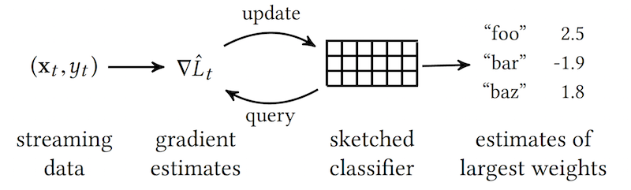

# Sketching Linear Classifiers over Data Streams



The code in this repository supplements the SIGMOD 2018 paper
[Sketching Linear Classifiers over Data Streams](https://arxiv.org/abs/1711.02305) by
Kai Sheng Tai, Vatsal Sharan, Peter Bailis, and Gregory Valiant.

The Weight-Median Sketch (WM-Sketch) and Active-Set Weight-Median Sketch (AWM-Sketch) are two algorithms for learning
compressed, memory-budgeted linear classifiers on streaming data.
In addition to supporting fast binary classification, these sketches also support the approximate retrieval of 
high-magnitude model weights in the original, uncompressed feature space -- this is analogous to the estimation of
frequent items using the [Count-Sketch](https://pdfs.semanticscholar.org/7a24/af4e7cf35dbaad00cda7612b7d3629735ea7.pdf) 
or the [Count-Min Sketch](https://pdfs.semanticscholar.org/94f8/b1efb80dd85b917a1be7c4cb2d90ef87cb54.pdf).  
The WM-Sketch and AWM-Sketch can be seen as improved variants of [feature hashing](https://en.wikipedia.org/wiki/Feature_hashing),
a commonly-used technique for handling high-dimensional feature spaces (e.g., in 
[scikit-learn](http://scikit-learn.org/stable/modules/generated/sklearn.feature_extraction.text.HashingVectorizer.html)
and [Vowpal Wabbit](https://github.com/JohnLangford/vowpal_wabbit)). 

# Build

The code can be built using CMake. From the root project directory, run:

```shell
mkdir build
cd build
cmake -DCMAKE_BUILD_TYPE=Release ..
make
```

This builds the library `libwmsketch` and the binaries `wmsketch_classification` and `wmsketch_pmi`. 
`wmsketch_classification` trains binary linear classifiers using the WM-Sketch and other baseline methods described
 in the paper. `wmsketch_pmi` is an application of the WM-Sketch to streaming pointwise mutual information estimation --
  this is described in more detail below. 

# Binary Classification

The `wmsketch_classification` binary trains logistic regression classifiers using the WM-Sketch, AWM-Sketch, and with
a number of other baseline methods described in the paper.
Training and testing data should be provided in LIBSVM format -- many standard classification datasets are available in
LIBSVM format at [this link](https://www.csie.ntu.edu.tw/~cjlin/libsvmtools/datasets/binary.html).

For example, RCV1 binary classification dataset can be downloaded 
[here](https://www.csie.ntu.edu.tw/~cjlin/libsvmtools/datasets/binary/rcv1_test.binary.bz2) 
(we use the split marked "test" for training since it is larger than the "train" split).

Run:

```shell
wmsketch_classification --train <dataset_dir>/rcv1_test.binary
``` 

This outputs the following in JSON format:

```json
{
    "params": {
        "consv_update": false,
        "count_smooth": 1.0,
        "depth": 1,
        "feature_dim": 47237,
        ...
    },
    "results": {
       ...
       "train_count": 677399,
       "train_err_count": 34049,
       "train_err_rate": 0.050264319846944,
       "train_ms": 13078
    }
}
```

The `train_err_rate` field indicates the online error rate achieved by the classifier: the number of examples that were
misclassified by the classifier before applying the online update. This value can differ from run to run due to the
randomness in defining the sketch -- for deterministic results, the random seed can be set using the `--seed` option.

The `top_indices` and `top_weights` fields indicate the estimates for the highest-magnitude model weights. These can be
compared to the indices and weights returned when training a full, uncompressed classifier (using the option 
`--method logistic`) to evaluate the accuracy of top-_k_ weight estimation achieved by a memory-budgeted method. 

By default, the executable uses the AWM-Sketch to learn the classifier.
The full list of methods is:

- `logistic`: Uncompressed logistic regression
- `logistic_sketch`: WM-Sketch
- `activeset_logistic`: AWM-Sketch
- `truncated_logistic`: Simple truncation to _k_ highest-magnitude features
- `probtruncated_logistic`: Probabilistic truncation to _k_ highest-magnitude features (similar to weighted reservoir sampling)
- `countmin_logistic`: Track most frequent features as estimated by a Count-Min sketch
- `spacesaving_logistic`: Track most frequent features as estimated by the Space Saving algorithm 

For the feature hashing baseline, run with the options `--method logistic_sketch --depth 1`. 
See the paper for full details on the baseline methods.

For a full list of options, run:

```shell
wmsketch_classification --help
```

# Application: Streaming Pointwise Mutual Information Estimation

[Pointwise mutual information](https://en.wikipedia.org/wiki/Pointwise_mutual_information) (PMI) is an
information theoretic measure of association between random events. In natural language processing, PMI
is often used as a measure of the degree to which pairs of words tend to co-occur in text -- bigrams with
high PMI are more "phrase-like" since the occurrence of one word is indicative of the co-occurrence of the other.
In fact, the popular word2vec skip-gram algorithm for learning word embeddings can be
[interpreted](http://papers.nips.cc/paper/5477-neural-word-embedding-as-implicit-matrix-factorization.pdf) as an
implicit factorization of a matrix of PMI values.

As an application of the WM-Sketch, we show how pairs of words with high PMI values can be estimated online from
a stream of text data while using a small memory budget of less than 2MB.

## Data

In the paper, we ran on the first 20 files of the 
[Google Billion-Word Language Modeling Benchmark](https://github.com/ciprian-chelba/1-billion-word-language-modeling-benchmark),
 which was derived from a newswire corpus.
This dataset can be downloaded [here](http://lisaweb.iro.umontreal.ca/transfert/lisa/users/leonardn/billionwords.tar.gz).

## Run

Following the `--data` flag, the executable accepts a list of whitespace-delimited paths to data files. We assume that
each line in each file is a separate sentence and that each sentence has already been tokenized.

For example, to run on the first two files of the dataset:

```shell
wmsketch_pmi --data <dataset_dir>/news.en-00001-of-00100 <dataset_dir>/news.en-00002-of-00100
```

This outputs a list of bigrams along with their estimated PMI values in JSON format:

```json
{
    ...
    "results": {
        "num_tokens": 7769690,
        "tokens": [
          [
            "!",
            "!"
          ],
          [
            "don",
            "'t"
          ],
          [
            "per",
            "cent"
          ],
          [
            "united",
            "states"
          ],
          [
            "$",
            "million"
          ],
          ...
        ],
        ...
    }
}
```

For a full list of options, run:

```shell
wmsketch_pmi --help
```
